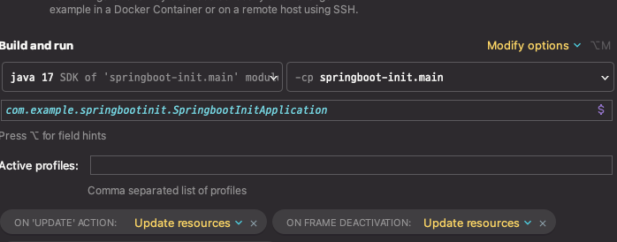

# springboot-init

* spring init library


* build
```./gradlew clean bootjar ```


* run test
```  java -Dspring.profiles.active=local -Durl=jdbc:mariadb://host.docker.internal:3306/spring-init -jar build/libs/*.jar ```


* docker build test
``` docker build -t spring-init . ```

  

* spring devtools livereload, restart application edit

